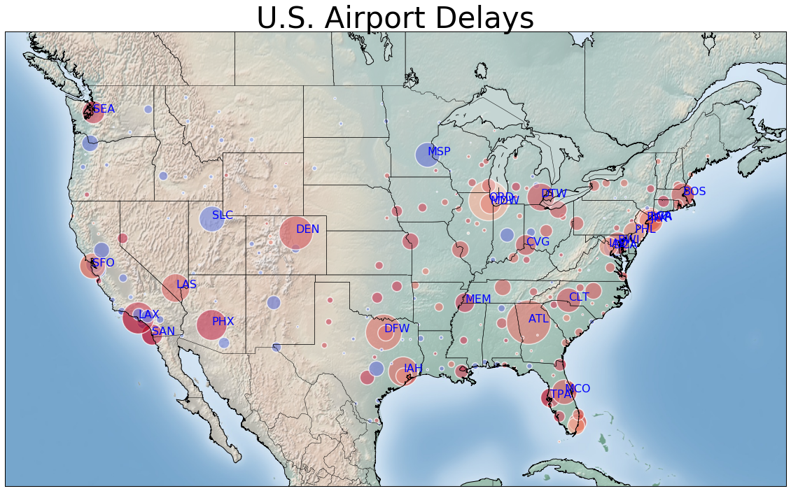

## Delayed-Flights

#### Overview
- This workbook will explore the "[`Flights Dataset`](http://stat-computing.org/dataexpo/2009/the-data.html)" and predict delayed flights at airports located in the United States bases on previous flight records. The dataset consists of flight information such as arrival and departure times. Additionally, the .dat file for plotting the geographical location of airports in the U.S. can be found [`here`](https://github.com/jpatokal/openflights/blob/master/data/airports.dat). Python 2.7.11  and the Jupyter Ipython Notebook and is utilized to explore, analyze, and visualize the results. This dataset examines flights in 2008 which is roughly 7 million flights! We will run Apache Spark (locally) for general data processing. The .csv files containing the flight data and the airport attributes are imported as separate tables in a PostgresSQL database for querying. 

#### Software and Libraries
- Python 2.7
- NumPy
- matplotlib.pyplot 
- iPython Notebook
- Basemap 1.0.7

#### Spark

- Install process...

#### Analysis 

- The figure below displays the aiports with more than 70,000 flights recorded in the dataset in 2008. Airports with larger markers represent a higher magnitude of the total number of flights. Darker the marker fill, the higher the probabiity is for increased delayed times when departing from the respected airports. We can see from the geographical plot below that out of the queried airports in the United States, places like DFW, LAX, or ATL tend to have heavier delays and based on past experiences, our data is behaving as expected. As a note, viewing the code inside the `flights.ipynb` allows the user to zoom further, eliminating some of the overlap of airports observed belows, specifically on the East coast. 

